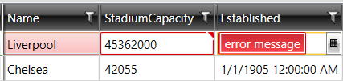

# CustomDataTable
A DataTable with a DataRow that implements INotifyDataErrorInfo for async-validation.  

#### Example
In your view-model (or code-behind): 
```
//1. Property to bind your grid ItemsSource to
public CustomDataTable Data
{
  get
  {
     if (data == null)
     {
       data = GenerateData();
     }
     
     return data;
  }
}

// your Data (usually from a DB)
private CustomDataTable GenerateData()
{
  CustomDataTable dataTable = new(); 
  dataTable.AddColumn("Name", true); // readonly
  dataTable.AddColumn("StadiumCapacity", typeof(int));    
  dataTable.AddColumn("Established", typeof(DateTime));

  var row = dataTable.NewCustomRow();
  row.SetPropertyValue("Name", "Liverpool");
  row.SetPropertyValue("StadiumCapacity", 45362);
  row.SetPropertyValue("Established", new DateTime(1892, 1, 1));
  dataTable.Add(row);

  // ... additional rows 
}

//2.  An async validation example: Cell validation 
// Hint: Row validation would be similar, but you use some row-event
public async Task ValidateEditedCell(CustomDataRow currentRow)
{
  var columnName = "StadiumCapacity"; // Use your available grid events to get the column name, like CellEditEnd (control-dependent) 
  object? cellValue = currentRow[columnName];
  // Call your async validation method to validate the 'cellValue'
  await Task.Delay(2000); // simulation: Validation took 2 sec
  // The validation method returns 'false'? Add the error to the row:
  currentRow.AddError(columnName, "error message"); // the grid cell would be red marked, and a tool  
}

```  
##### Result


